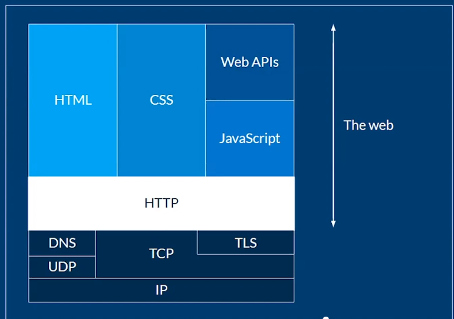
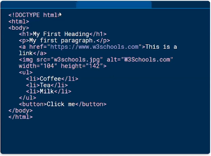
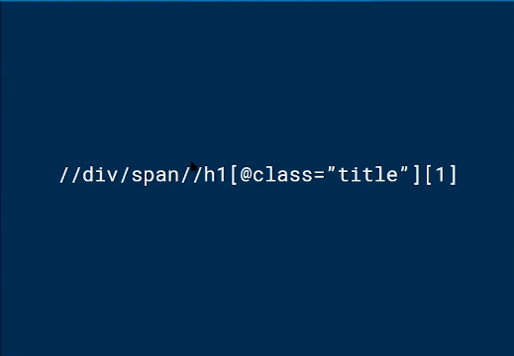
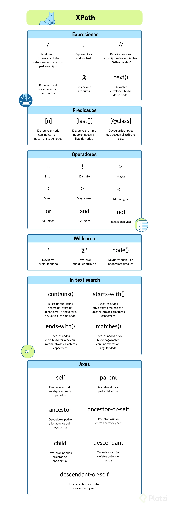

# Curso de Fundamentos de Web Scraping con Python y Xpath

- [Curso de Fundamentos de Web Scraping con Python y Xpath](#curso-de-fundamentos-de-web-scraping-con-python-y-xpath)
  - [Modulo 1 Introducción al web scraping](#modulo-1-introducción-al-web-scraping)
    - [Clase 1 Que es el web scraping](#clase-1-que-es-el-web-scraping)
    - [Clase 2 Por que aprender web scraping hoy](#clase-2-por-que-aprender-web-scraping-hoy)
    - [Clase 3 Python: el lenguaje más poderoso para extraer datos](#clase-3-python-el-lenguaje-más-poderoso-para-extraer-datos)
  - [Modulo 2 Fundamentos de la web](#modulo-2-fundamentos-de-la-web)
    - [Clase 4 Entender HTTP](#clase-4-entender-http)
    - [Clase 5  Que es HTML](#clase-5-que-es-html)
    - [Clase 6 Robots.txt: permisos y consideraciones al hacer web scraping](#clase-6-robotstxt-permisos-y-consideraciones-al-hacer-web-scraping)
  - [Modulo 3 XML Path Language](#modulo-3-xml-path-language)
    - [Clase 7 XML Path Language](#clase-7-xml-path-language)
    - [Clase 8 Tipos de nodos en XPath](#clase-8-tipos-de-nodos-en-xpath)
    - [Clase 9 Expresiones en XPath](#clase-9-expresiones-en-xpath)
    - [Clase 10 Predicados en Xpath](#clase-10-predicados-en-xpath)
    - [CLase 11 Operadores en Xpath](#clase-11-operadores-en-xpath)
    - [Clase  12 Wildcards en Xpath](#clase-12-wildcards-en-xpath)
      - [wildcard node()](#wildcard-node)
    - [Clase 13 In-text search en Xpath](#clase-13-in-text-search-en-xpath)
    - [Clase 14 Xpath Axes](#clase-14-xpath-axes)
    - [Clase 15 Resumen de XPath](#clase-15-resumen-de-xpath)
    - [Clase 16 Aplicando lo aprendido](#clase-16-aplicando-lo-aprendido)
  - [Modulo 4 Proyecto: scraper de noticias](#modulo-4-proyecto-scraper-de-noticias)
    - [Clase 17 Un proyecto para tu portafolio: scraper de noticias](#clase-17-un-proyecto-para-tu-portafolio-scraper-de-noticias)
    - [Clase 18 Construcción de las expresiones de XPath](#clase-18-construcción-de-las-expresiones-de-xpath)
    - [Clase 19  Obteniendo los articulos con python](#clase-19-obteniendo-los-articulos-con-python)
    - [Clase 20  Guardando las noticias en archivos de texto](#clase-20-guardando-las-noticias-en-archivos-de-texto)
  - [Modulo 5 Conclusiones](#modulo-5-conclusiones)
    - [Clase 21 Como continuar tu ruta de aprendizaje](#clase-21-como-continuar-tu-ruta-de-aprendizaje)


## Modulo 1 Introducción al web scraping

### Clase 1 Que es el web scraping

Introducción por el profesor

### Clase 2 Por que aprender web scraping hoy

Analizar contenido, obtener datos, comprar precios, usado por backends y data scientists.

### Clase 3 Python: el lenguaje más poderoso para extraer datos

Python tiene muchos modulos para el web scrapping, tenemos requests, y Beautiful Soup, selenium, y Scrapy usado por el UK para recolectar diario datos de la poblacion.

## Modulo 2 Fundamentos de la web

### Clase 4 Entender HTTP

Http es un protocolo para comunicación entre un cliente y un servidor


Algunos conceptos



IP: Internet Protocol
TCP: Transmision Control Protocol
UDP: User Data Protocol
DNS: Domain Name Server

Tipos de respuestas Http

1.- Respuestas informativas (100–199).
2.- Respuestas satisfactorias (200–299).
3.- Redirecciones (300–399).
4.- Errores de los clientes (400–499).
5.- Errores de los servidores (500–599).

### Clase 5  Que es HTML

Hypertext Markup Language



### Clase 6 Robots.txt: permisos y consideraciones al hacer web scraping

Robots.txt siempre se debe encontraren la raiz de un sitio.

```url
www.platzi.com/robots.txt
````

```html
User-Agent: *
Allow: /
Disallow: /*/*/concepto/*/*/material/
Disallow: /login/facebook/
Disallow: /login/twitter/
Disallow: /*/*/live/
Disallow: /*/*/%7B%7Burl%20absolute=/
Disallow: /*/*/add_contribution/
Disallow: /mi-suscripcion/
Disallow: /r/
Disallow: /clases/*/nuevos_materiales/
Disallow: /kit-ui/
Disallow: /ui/
Disallow: /sfotipy/
Disallow: /streaming/*
Disallow: /*?*
Disallow: /payments/*
Disallow: /*/add_review/
Disallow: /*/save/
Disallow: /adquirir/*
```

## Modulo 3 XML Path Language

### Clase 7 XML Path Language

XML Extensible Markup Language, como html y xml son muy parecidos, podemos usar XPath

xpath es a html como las expresiones regulares a un texto



### Clase 8 Tipos de nodos en XPath
 
Nodo: Es una etiqueta html con todo lo que contiene en su interior.

Usaremos la pagina <http://toscrape.com/> 

### Clase 9 Expresiones en XPath

```js
// slash significa el root el elemento, o un salto entre nodos.
$x('/')

// Selecciona un nodo
$x('/html')

// todos los nodos
$x('//') 

// Extraer el texto que contiene el nodo 
$x('//h1/a/text()').map(x => x.wholeText)

// todos los nodos que son padre de
$x('//span/..')

// El nodo actual
$x('//span/..')

// Extraer atributos @
$x('//span/@class')
```
### Clase 10 Predicados en Xpath

Los predicados los hacemos con corchetes

```js
// Traer el primer elemento
$x('/html/body/div/div[1]')

// Traer el ultimo elemento
$x('/html/body/div/div[last()]')

// Traer todos los elementos con un atributo
$x('//span[@class="text"]/text()').map(x => x.wholeText)
```

### CLase 11 Operadores en Xpath

<!-- Filtrando con operadores  -->
$x('//span[@class!="text"])

<!-- Traer los divs con posicion mayor a 5 -->
$x('//html/body/div/div[position()>5]')

<!-- Usando and 
 -->
$x('//span/[@class="text" and @class="tag-item"]')

<!-- Usando or -->
$x('//span/[@class="text" or @class="tag-item"]')

<!-- Usando not -->
$x('//span/[not(@class)']

### Clase  12 Wildcards en Xpath

* trae todo lo demas (como regex)

```js
$x('/*')
[html]
$x('/html/*')
(2) [head, body]
$x('//*')
(151) [html, head, meta, title, link, link, body, div.container, div.row.header-box, div.col-md-8, h1, a, div.col-md-4, p, a, div.row, div.col-md-8, div.quote, span.text, span, small.author, a, div.tags, meta.keywords, a.tag, a.tag, a.tag, a.tag, div.quote, span.text, span, small.author, a, div.tags, meta.keywords, a.tag, a.tag, div.quote, span.text, span, small.author, a, div.tags, meta.keywords, a.tag, a.tag, a.tag, a.tag, a.tag, div.quote, span.text, span, small.author, a, div.tags, meta.keywords, a.tag, a.tag, a.tag, a.tag, div.quote, span.text, span, small.author, a, div.tags, meta.keywords, a.tag, a.tag, div.quote, span.text, span, small.author, a, div.tags, meta.keywords, a.tag, a.tag, a.tag, div.quote, span.text, span, small.author, a, div.tags, meta.keywords, a.tag, a.tag, div.quote, span.text, span, small.author, a, div.tags, meta.keywords, a.tag, a.tag, a.tag, a.tag, div.quote, …]
```

```js
$x('//span[@class=text"]/@*')

$x('//span[@class="text"]/@*')
(20) [class, itemprop, class, itemprop, class, itemprop, class, itemprop, class, itemprop, class, itemprop, class, itemprop, class, itemprop, class, itemprop, class, itemprop]

```

#### wildcard node()

**Node()** es similar a '*', pero este nos trae no solo los nodos sino lo que esta al final del nodo.

```js
$x('//span[@class="text" and @itemprop="text"]/node()')
(10) [text, text, text, text, text, text, text, text, text, text]
0: text
assignedSlot: null
baseURI: "http://quotes.toscrape.com/"
childNodes: NodeList []
data: "“The world as we have created it is a process of our thinking. It cannot be changed without changing our thinking.”"
firstChild: null
isConnected: true
lastChild: null
length: 115
nextElementSibling: null
nextSibling: null
nodeName: "#text"
nodeType: 3
nodeValue: "“The world as we have created it is a process of our thinking. It cannot be changed without changing our thinking.”"
ownerDocument: document
parentElement: span.text
parentNode: span.text
previousElementSibling: null
previousSibling: null
textContent: "“The world as we have created it is a process of our thinking. It cannot be changed without changing our thinking.”"
wholeText: "“The world as we have created it is a process of our thinking. It cannot be changed without changing our thinking.”"
__proto__: Text
1: text
2: text
3: text
4: text
5: text
6: text
7: text
8: text
9: text
length: 10
__proto__: Array(0)
```

### Clase 13 In-text search en Xpath

**Reto** traer todos los autores que en su nombre empiezan con la letra "a", y terminan con la letra "l"

Inicia con letra "A"

```js
$x('//small[@class="author" and starts-with(., "A")]/text()').map(x =>x.wholeText)
(4) ["Albert Einstein", "Albert Einstein", "Albert Einstein", "André Gide"]
```

El nombre contiene "Ro"

```js
$x('//small[@class="author" and contains(., "Ro")]/text()').map(x =>x.wholeText)
(2) ["J.K. Rowling", "Eleanor Roosevelt"]
```

Termina con letra "t"

```js
$x('//small[@class="author" and ends-with(., "l")]/text()').map(x =>x.wholeText)
VM3928:1 Uncaught DOMException: Failed to execute '$x' on 'CommandLineAPI': The string '//small[@class="author" and ends-with(., "l")]/text()' is not a valid XPath expression.
    at <anonymous>:1:1
(anonymous) @ VM3928:1
// No funciona porque el navegador esta basado en la version 1 de xpath
```

Matches busca en si existe texto en nodo que coincida con una expresión regular

```js
$x('//small[@class="author" and matches(., "A.*n")]/text()').map(x =>x.wholeText)
```

### Clase 14 Xpath Axes

Recursos adicionales
<https://www.w3schools.com/xml/xpath_axes.asp>

el termino 'div/.' equivale a self::div es azúcar sintáctica

```js
$x('/html/body/div/child::div')
(2) [div.row.header-box, div.row]
$x('/html/body/div/descendant-or-self::div')
(27) [div.container, div.row.header-box, div.col-md-8, div.col-md-4, div.row, div.col-md-8, div.quote, div.tags, div.quote, div.tags, div.quote, div.tags, div.quote, div.tags, div.quote, div.tags, div.quote, div.tags, div.quote, div.tags, div.quote, div.tags, div.quote, div.tags, div.quote, div.tags, div.col-md-4.tags-box]
```

### Clase 15 Resumen de XPath



### Clase 16 Aplicando lo aprendido

Desde <http://books.toscrape.com/>

Extraer todos los nombres de los libros

```js
$x('//article[@class="product_pod"]/h3/a/@title').map(x => x.value)

(20) ["A Light in the Attic", "Tipping the Velvet", "Soumission", "Sharp Objects", "Sapiens: A Brief History of Humankind", "The Requiem Red", "The Dirty Little Secrets of Getting Your Dream Job", "The Coming Woman: A Novel Based on the Life of the Infamous Feminist, Victoria Woodhull", "The Boys in the Boat: Nine Americans and Their Epic Quest for Gold at the 1936 Berlin Olympics", "The Black Maria", "Starving Hearts (Triangular Trade Trilogy, #1)", "Shakespeare's Sonnets", "Set Me Free", "Scott Pilgrim's Precious Little Life (Scott Pilgrim #1)", "Rip it Up and Start Again", "Our Band Could Be Your Life: Scenes from the American Indie Underground, 1981-1991", "Olio", "Mesaerion: The Best Science Fiction Stories 1800-1849", "Libertarianism for Beginners", "It's Only the Himalayas"]
```

Extraer todos los precios de todos los libros

```js
$x('//article[@class="product_pod"]/div[@class="product_price"]/p[@class="price_color"]/text()').map(x => x.wholeText)
(20) ["£51.77", "£53.74", "£50.10", "£47.82", "£54.23", "£22.65", "£33.34", "£17.93", "£22.60", "£52.15", "£13.99", "£20.66", "£17.46", "£52.29", "£35.02", "£57.25", "£23.88", "£37.59", "£51.33", "£45.17"]
```

Extraer las categorías

```js
$x('//div[@class="side_categories"]/ul[@class="nav nav-list"]/li/ul/li/a/text()').map(x => x.wholeText)
```

## Modulo 4 Proyecto: scraper de noticias

### Clase 17 Un proyecto para tu portafolio: scraper de noticias

La pagina target <https://www.larepublica.co/>

Creamos el repositorio

Creamos el venv e instalamos las librearías

```py
pip3 install requests lxml autopep8
```

### Clase 18 Construcción de las expresiones de XPath

```py
# $x('//h2[@class="headline"]/a/@href').map(x => x.value)
links = '//h2[@class="headline"]/a/@href'


# titulo ('//h1[@class="headline"]/a/text()
titulo = '//h1[@class="headline"]/a/text()''
Resumen = '//div[@class="lead"]/p/text()'
Cuerpo =  '//div[@class="articleWrapper  "]/p[not(@class)]/text()'

Subtitle = //div[@class="row"]/header/span[@class="subheadline"]/text()
Body = //div[@id="article-content"]/div[@class="row pb-content-type-text"]//p/text()
```

### Clase 19  Obteniendo los articulos con python

```py
import requests
import lxml.html as html
import os
import datetime

HOME_URL = 'https://www.larepublica.co/'

XPATH_LINK_TO_ARTICLE = '//h2[@class="headline"]/a/@href'
XPATH_TITLE =  '//h1[@class="headline"]/a/text()'
XPATH_SUMMARY = '//div[@class="lead"]/p/text()'
XPATH_BODY = '//div[@class="articleWrapper  "]/p[not(@class)]/text()'


def parse_notice(link, today):
    try:
        response = requests.get(link)
        if response.status_code == 200:
            notice = response.content.decode('utf-8')
            parsed = html.fromstring(notice)
            try:
                title = parsed.xpath(XPATH_TITLE)[0]
                title = title.replace('\"', '')
                title = title.replace('/', '-')
                summary = parsed.xpath(XPATH_SUMMARY)[0]
                body = parsed.xpath(XPATH_BODY)
            except IndexError:
                return
        else:
            raise ValueError(f'Error: {response.status_code}')
    except ValueError as  ve:
        print(ve)

def parse_home():
    try:
        response = requests.get(HOME_URL)
        if response.status_code == 200:
            home = response.content.decode('utf-8')
            parsed = html.fromstring(home)
            links_to_notices = parsed.xpath(XPATH_LINK_TO_ARTICLE)
            # print(links_to_notices)
            today = datetime.date.today().strftime('%d-%m-%Y')
            if not os.path.isdir(today):
                os.mkdir(today)

            for link in links_to_notices:
                parse_notice(link, today)

        else:
            raise ValueError(f'Error: {response.status_code}')

    except ValueError as ve:
        print(ve)


def run():
    parse_home()


if __name__ == '__main__':
    run()
```

### Clase 20  Guardando las noticias en archivos de texto

```py
import requests
import lxml.html as html
import os
import datetime

HOME_URL = 'https://www.larepublica.co/'

XPATH_LINK_TO_ARTICLE = '//h2[@class="headline"]/a/@href'
XPATH_TITLE =  '//h1[@class="headline"]/a/text()'
XPATH_SUMMARY = '//div[@class="lead"]/p/text()'
XPATH_BODY = '//div[@class="articleWrapper  "]/p[not(@class)]/text()'


def parse_notice(link, today):
    try:
        response = requests.get(link)
        if response.status_code == 200:
            notice = response.content.decode('utf-8')
            parsed = html.fromstring(notice)
            try:
                title = parsed.xpath(XPATH_TITLE)[0]
                title = title.replace('\"', '')
                title = title.replace('/', '-')
                summary = parsed.xpath(XPATH_SUMMARY)[0]
                body = parsed.xpath(XPATH_BODY)
            except IndexError:
                return
            with open(f'{today}/{title}.txt', 'w', encoding='utf-8') as f:
                f.write(title)
                f.write('\n\n')
                f.write(summary)
                f.write('\n\n')
                for p in body:
                    f.write(p)
                    f.write('\n')
        else:
            raise ValueError(f'Error: {response.status_code}')
    except ValueError as  ve:
        print(ve)

def parse_home():
    try:
        response = requests.get(HOME_URL)
        if response.status_code == 200:
            home = response.content.decode('utf-8')
            parsed = html.fromstring(home)
            links_to_notices = parsed.xpath(XPATH_LINK_TO_ARTICLE)
            # print(links_to_notices)
            today = datetime.date.today().strftime('%d-%m-%Y')
            if not os.path.isdir(today):
                os.mkdir(today)

            for link in links_to_notices:
                parse_notice(link, today)

        else:
            raise ValueError(f'Error: {response.status_code}')

    except ValueError as ve:
        print(ve)


def run():
    parse_home()


if __name__ == '__main__':
    run()
```

## Modulo 5 Conclusiones

### Clase 21 Como continuar tu ruta de aprendizaje

Consejos

* Revisa siempre robots.txt
* Ten en cuenta si violas alguna ley de proteccion de datos
* Si el medio es de pago, evita hacer web scrapping por default no es legal

<https://www.upwork.com/>
<https://www.workana.com/es>
